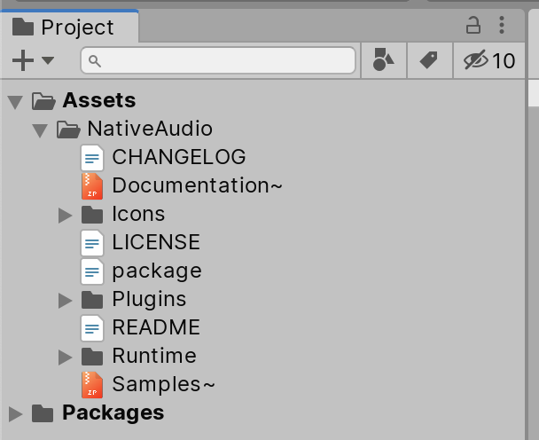
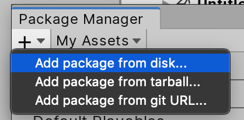
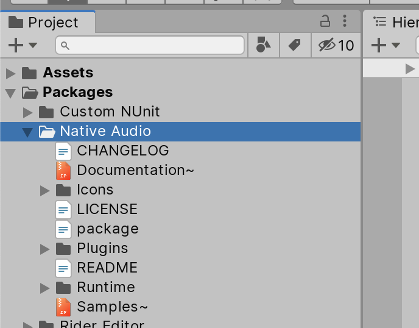

# Getting started

I assume you have completed reading [Sources of latency](../theories/sources-of-latency.md) and [Ways around latency](../theories/ways-around-latency.md).

> [!WARNING]
> Native Audio only supports **iOS and Android**. All those native interfacing methods has undefined behaviour on any other platforms, including the editor. (e.g. if you use Unity on Windows, the "native" right now is Windows, and Native Audio has no Windows support.) It will throw [`NotSupportedException`](https://docs.microsoft.com/en-us/dotnet/api/system.notsupportedexception?view=netframework-4.8) exception. It is your job to use directive such as `#if UNITY_EDITOR`, `#if UNITY_IOS`, or `#if UNITY_ANDROID` to gate keep all these native methods to not get called in editor or do something else, like falling back to `AudioSource` that you can actually hear. Still, Native Audio and `AudioSource` can be hard to map its behaviour one-to-one.

## Installation

### Get it

[Purchase a license of Native Audio](https://www.assetstore.unity3d.com/#!/content/107067) and import from Asset Store to your project.

You will see an optional `Documentation~.zip` and `Samples~.zip`. You can unzip them if you want to, which produces `Documentation~` and `Samples~` *unimported folder* because they are [suffixed with `~`](https://docs.unity3d.com/Manual/SpecialFolders.html). They have to be zipped as Asset Store do not yet support publishing folders with `~` on them.

This is great because there is no need to import images in the documentations nor import the samples when you are not even wanted to see them yet.

### Opt in to Unity Package Manager (UPM)

You have an option to use UPM linking since this package meets Unity's [package layout standard](https://docs.unity3d.com/Manual/cus-layout.html).

UPM cannot link to Asset Store directly yet, but after installing normally (via import), you can take the package out from the project, then use UPM to link locally to `package.json`, resulting in the package appearing in `Packages` section instead of `Assets` section. This make your `Assets` section remains cleanly only your game, the best package practice right now. You can link multiple projects to it too.

### Assembly Definition linking

Native Audio comes with [Assembly Definition File](https://docs.unity3d.com/Manual/ScriptCompilationAssemblyDefinitionFiles.html) `.asmdef` as a best practice for package design. To use any of core methods you have to connect your assembly to `E7.NativeAudio` (GUID : `6e1ceb5b6422b434084667bb46a254f6`). Then you can use `using E7.Native;` in the code to access various `NativeAudio.____` `static` methods.

Assembly Definitions are important because the package utilizes `internal` keywords, making the code more expressive than just `public/private`. If the package "merged" into your assembly, then you are able to see and use `internal` things that wasn't intended for you to use, and may cause confusion or wrong behaviour.

### Attributions

Native Audio is powered by **`libsamplerate` (Secret Rabbit Code) by Erik de Castro Lopo**. (http://www.mega-nerd.com/SRC/) It is to fit `AudioClip` with mismatched import settings to the device's native rate at runtime as explained in [Ways around latency](../theories/ways-around-latency.md).

Sampling is a huge topic and I cannot possibly get right by myself with acceptable quality. So `libsamplerate` can help on this with very good quality resampling method.

(If you are interested in learning more about audio resampling, I recommend this paper! : https://ccrma.stanford.edu/~jos/resample/ )

The license is 2-clause BSD which is really permissive and requires you only to put the attribution somewhere in the game. (You will do the 2nd clause, the file `LICENSE.md` included in your purchase is doing the 1st clause.)

To do this, check `LICENSE.md` included in the package to find a copy-pastable text.

## Initialize

Import the namespace `using E7.Native;` and initialize with `NativeAudio.Initialize(initializationOption)`. It is at this moment you get a certain number of "native sources" as explained in [Ways around latency](../theories/ways-around-latency.md).

If you want to customize the initialization, start from `InitializationOption.defaultOptions` and modify it before sending to `Initialize`. You can see the possible options of all methods in API reference page or the XML code documentation. One of them is to increase a number of native sources on Android for more concurrency at your own risk.

## Load

Get a reference of `AudioClip` and use `NativeAudio.Load(audioClip)`. You can use **any compression and any quality** on import such as Vorbis to save game space, they will be turned back to uncompressed raw audio at this moment and be copied to native side. We have no more business with `AudioClip` after this.

Each load returns an instance of `NativeAudioPointer`, a class wrapping an integer that when native side see it, it knows which audio memory to use. **You have to keep the returned `NativeAudioPointer`** both for play and for unloading it. Losing this pointer make you unable to unload the memory at native side!

There are other options you must be aware of :

- Load type MUST be **Decompress On Load** so Native Audio could read raw PCM byte array from your compressed `AudioClip`. Compressed In Memory or Streaming make that impossible.
- If you use **Load In Background**, you must call `audioClip.LoadAudioData()` beforehand **on your own** and ensure that `audioClip.loadState` is `AudioDataLoadState.Loaded` before calling `NativeAudio.Load(audioClip)`. Otherwise it would throw an exception. This is because Native Audio would not like to have to provide async load to wait while it is loading in background. If you are not using Load In Background **but also not** using Preload Audio Data, Native Audio **can** load for you if not yet loaded because it is now a blocking load.
- Could be mono or stereo, but must not be ambisonic.

> [!WARNING]
> You are **not** supposed to load every time you play. You **load once**, **keep** the pointer, and use the pointer for playing as **many times** as you like. If you keep loading and discard/overwrite the old pointer, not only that this is very slow, you are accumulating wasted RAM with no way to free those memory back. (It's native! No garbage collection!) Eventually, the phone need to close other process to get you more RAM, then if that process is your game it will crash. Causing segmentation fault (`SIGSEGV`) or other errors. Don't do it.

## Play

To play the pointer you obtained from load, in the same fashion as `AudioSource`, you need a target `NativeSource` to play. As explained in [Ways around latency](../theories/ways-around-latency.md) we have a limited number of sources that all couldn't mix for better latency. A new play on a particular source **instantly cut off previously playing audio on the source**.

- If you don't care about how this new play would stop which previous audio, use the easy `NativeAudio.GetNativeSourceAuto()` method. It uses round-robin source selection, just a next one from the previous play and wraps over. For example on Android by default it gives you 3 sources at initialize, round-robin would choose `0 1 2 0 1 2 0 1 ...`. This is simple, but maybe not ideal for everyone.
- If you would like to play on a specific source, obtain it with `NativeAudio.GetNativeSource(index)`. Available `index` number is zero-indexed of what you get at `Initialize`. If you got 3 native sources, then numbers you can use here are `0`, `1`, and `2`.

> [!TIP]
> There is also `NativeAudio.GetNativeSource(INativeSourceSelector)` overload where you can create your own logic inside `INativeSourceSelector` that outputs a different integer index each time!

Go to [Selecting native sources](selecting-native-sources.md) page for some example strategies that may help you use `NativeAudio.GetNativeSource(index)` effectively.

After you get a hold of `NativeSource`, just call `nativeSource.Play(nativeAudioPointer)` instance method on it. You can also use `PlayOptions` overload to customize your play, begin making the option from `PlayOptions.defaultOptions`.

> [!TIP]
> You can keep and cache the `NativeSource` the same way you keep a variable of `AudioSource`, for multiple uses.

### After each play

The `NativeSoure` you just used to play has some other functions to control the played audio in the same way `AudioSource` could. For example `Stop()` the played audio before it ends.

## Release

Native Audio requires **manual** memory management since the memory stays outside of C#.

### Releasing loaded `AudioClip` memory

Simply use the `.Unload()` instance method on the `NativeAudioPointer`.

**Do not unload while you know the audio is playing.** Due to latency-focused design, a safety check to properly stop the source that is playing the audio before unloading it is **not implemented by design**. Or else the code need to run through that check every play. This code is a very hot code path, that I decided to do something more unsafe and have you be careful about it on your own.

Think that there is no association between native source and audio memory at all. On each play the source is told to run through memory starting from some point by some length. If you unload while it is being played by any native sources, the source will be instead running thorough undefined memory for remaining length it was given. Depending on phones, this may produce loud glitchy sound (best case) or crash because of out of bounds memory was accessed (worst case).

### Releasing initialized native sources

Other than loaded `AudioClip` memory there are also the native sources themselve you got from `NativeAudio.Initialize()`. Those could be returned to the OS too via `NativeAudio.Dispose()`.

On Android when minimizing the app, `NativeAudio` will do `NativeAudio.Dispose()` automatically and `NativeAudio.Initialize()` back the same amount with the same settings. This is to prevent [wake lock](https://developer.android.com/training/scheduling/wakelock) which drains your user's battery, hogging native sources unnecessarily, and may result in a warning from Google App Store that your game is producing a wake lock. (Gamers often minimize the game and forgot, it is bad if your game minimize but still keep native sources active.) There is an option on initialization to override this behaviour. (Generally not recommended.)