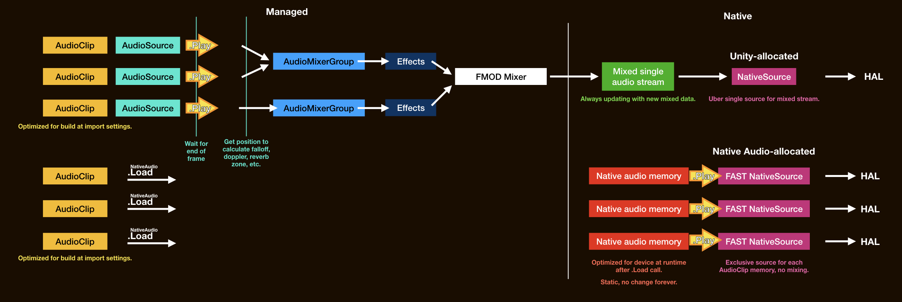

> [!Video https://www.youtube.com/embed/px43SrrE5GI]

So your Unity game outputs WAY slower audio than other apps *even on the same device*? Turns out, Unity adds as much as **79%** of the total latency you hear. Your devices can do better.

Unity won't let you use only a subset of its hard-wired audio pipeline. But with **Native Audio** we can go native and make as much compromises as we want. Simplify, take dirty shortcuts, and **aim for the lowest latency**. Sacrificing functions and convenience that Unity was designed for as a friendly game engine.

I have researched into the cause for so long, finally the complete solution is right here.

## How is this possible?

([View in full](theories/images/after.jpg))

<video controls class="" style="width:400px;" src="images/sargon-test.mp4"></video>

Read in full details in an explainer [Sources of latency](theories/sources-of-latency.md). In brief :

- Unity didn't intialize the **native source** with the lowest latency settings, but with the safest and defensive settings.
- Unity need to **mix audio** internally with [FMOD](https://www.fmod.com/) to enable any *concurrent* audio at all. Or else you can only hear an *individial* imported `AudioClip` at any point. (That would sucks as a game, we aren't here to make a music player, and we don't want to fire a single bullet that mutes an entire music, either.)
- Unity has many convenient functions to be worthy enough to be called a game engine. Like `AudioMixerGroup`, volume faders, effects, limiting, `AudioSource` priority and spatial position, `AudioClip` flexible import settings that all "just works", etc. All combined, it is inevitable having to wait at some point.

Native Audio allows us to break the norm and go for what normally would be considered crippled for a game engine : 

- Request the OS **more native sources for our own**, completely independent of the one Unity requested and is pumping mixed audio to, going through all the bells and whistles.
- Export an `AudioClip` data to a new memory area that native side could read. Give the native side a pointer to this memory. Warm up and ready source as much as possible like a runner on a starting block ready to sprint.
- At the critical moment, signal from C# to native side for our exclusive native source to play that memory. Just run through it. **No mixing**. Just want to hear this `AudioClip` with nothing else, just want to hear this file like I double clicked on it. Instantly **at this line of code**, not even waiting to the end of this frame. **The `Play` call is now much closer to the HAL.**
- With multiple instances of native sources requested, we can have back limited concurrency while staying unmixed.
- Still keep the Unity-way around for audio that aren't critical but require higher concurrency. Let them take time to mix. Selectively play critical audio in Native Audio's express lane.

This allows the fastest latency it could be with some sacrifices. Theoretically, no amount of external audio middlewares technologies or any future Unity updates could possibly beat native play as barebone as this in terms of latency. **Native Audio helps you do this across 2 platforms of iOS and Android, using the same common C# interface.**

## Various use cases

While not able to mix greatly reduce flexibility, and preparations for native play could be messy, this is very useful for **small but critical audio**.

By being small we have already eliminated the need to mix. Like a hit sound in music games where you can't predict if it will or will not sound and must wait for performance judgements. Instrument's feedback sound in a virtual instrument with short sustain and low number of distinct sounds. Even with something generic like UI response sound, where hearing feedback slower than a certain threshold after the user feel the touchscreen's glass (which already took so much input latency time) will greatly deteriorate user experience.

The key is "response sound". If you can predict the future that something should sound at some precise point in the future, there is no reason to use Native Audio over [`PlayScheduled`](https://docs.unity3d.com/ScriptReference/AudioSource.PlayScheduled.html) at all. Native Audio is rather for "I just realized I want to hear something now, so play it now." problem.

For example if you are making a music player, that is clearly an audio app. But audio latency won't affect user experience at all because all the interaction you do is press play and listen. It's not like if the song starts a bit late then an entire song is ruined. The core experience is on the song itself not a timing.

But if a feedback sound lags? Imagine a drumming game that you have to hit at the correct moment. If you hit perfectly and the game says so, the sound will come later. If you hit early the game punishes you, the sound will instead be exact. It's this kind of problem.

## Android high-performance audio ready 

It improves latency for iOS also, but I guess many came here in hope to fix the horrible Android latency, even before Unity added its things on top.

I am proud to present that Native Audio is following **all of Google's official best practices** required to achieve [**High-Performance Audio in Android**](https://developer.android.com/ndk/guides/audio/). All from the initialization of native sources to playing them : 

- Uses C/NDK level `OpenSL ES` and not Java `MediaPlayer`, `SoundPool`, or `AudioTrack`. Plus, most latency-critical interfacing methods call from Unity are by `extern` to C and not by JNI with `AndroidJavaClass` to Java. Feature set of `OpenSL ES` that would add latency has been deliberately removed at initialization.
- **Ensuring "[Fast Track](https://source.android.com/devices/audio/latency/design#fastMixer)"** audio being instantiated at hardware level, not a normal one. Native Audio does not have any kind of application level mixer and each sound goes straight to this fast track. Currently Unity may or may not get the fast track due to sample rate mismatch, moreover often getting a deep buffer thread, designed for power saving but with the worst latency.
- **Built-in resampler.** Resample your audio on the fly to match "device native sample rate". Each phone has its own preferred sample rate, a requirement to use the fast track.
- **Minimum jitter** by zero-padded audio memory, so that the length is exactly a multiple of "device native buffer size" to ensure [consistent scheduling](https://source.android.com/devices/audio/latency/design#fastMixer). Each phone has its own preferred buffer size.
- **Double buffering** so your audio playing start as soon as possible, unlike a lazy single buffering which we must push entirely of the audio into the playing buffer. (This is not the same step as loading the audio, we must go through this step on every play.) Combined with the previous point the workload of each callback [is deterministic](https://developer.android.com/ndk/guides/audio/opensl/opensl-prog-notes#perform).
- Automatically receives better audio latency from [future system performance improvements](https://developer.android.com/ndk/guides/audio/opensl/opensl-prog-notes#perform).

Of course, with [publicly available thorough research and confirmations](https://gametorrahod.com/androids-native-audio-primer-for-unity-developers-65acf66dd124). This means it can perform even better than native Android app that was coded naively/lazily in regarding to audio. Even pure Android developers might not want to go out of Java to C/NDK.

## How much faster?

We will do a measurement by placing the device in fixed position, one microphone recording the peak of nail sound hitting the screen to the response sound produced by the app out of speaker arriving to the same microphone. The touch is handled by Unity's UGUI and its `EventSystem`.

This is not at all a standard latency measurement approach like loopback cable method. The number alone is not comparable between devices too. However the **time difference of the same device truly show how much the latency improved because of Native Audio**.

|**DEVICE (INTRODUCTION YEAR)**|**EVENT SYSTEM -> AUDIOSOURCE BEST LATENCY**|**EVENT SYSTEM -> NATIVE AUDIO (EFFICIENCY)**|**NATIVE TOUCH -> NATIVE AUDIO (EFFICIENCY OF NATIVE TOUCH)**|
:-----:|:-----:|:-----:|:-----:
Xiaomi Mi A2 (2018 / 8.1.0 Oreo)|321.2 ms|78.2 ms (-75.65%)|74.2 ms (-5.12%)
Xperia Z5 (2015 / 7.1.1 Nougat)|120.6 ms|69 ms (-42.79%)|57.8 ms (-16.23%)
Lenovo A1000 (2015 / 5.1 Lollipop)|366.2 ms|217.4 ms (-40.63%)|209.2 ms (-3.77%)
Oneplus One (2014 / 9.0 Pie POSP ROM)|102.6 ms|59.4 ms (-42.11%)|53.8 ms (-9.43%)
Samsung Galaxy Note 5 (2015 / 7.0 Nougat)|260.4 ms|85.8 ms (-67.05%)|54.2 ms (-17.38%)
Samsung Galaxy Note 8 (2017 / 8.0.0 Oreo)|263.6 ms|65.6 ms (-75.11%)|71.2 ms (-17.02%)
Samsung Galaxy S7 Edge (2016 / 8.0.0 Oreo)|243.4 ms|67.4 ms (-72.31%)|60.4 ms (-10.39%)
Samsung Galaxy S9 Plus (2018 / 8.0.0 Oreo)|98 ms|56.6 ms (-42.24%)|40.2 ms (-28.98%)
iPod Touch Gen 5 (2012 / 9.3.5)|94.6 ms|58.8 ms (-37.84%)|48 ms (-18.37%)
iPad 3 (2012 / 9.3.5)|115.6 ms|67.4 ms (-41.7%)|52.8 ms (-21.66%)

[View benchmark details and analysis.](https://gametorrahod.com/androids-native-audio-primer-for-unity-developers-65acf66dd124#3d39)

> [!NOTE]
> The pure Unity's audio was measured with "Best Latency" settings on Audio Settings, the fastest playing (smallest buffer) Unity can achieve without any plugins.

> [!NOTE]
> Unity time in this table is pre-2019.1. If you build the game with Unity 2019.1 onwards, there is an upgrade in Unity audio latency for Android on some devices. Xiaomi Mi A2 for instance qualified for the upgrade. [Please check this article for details!](https://gametorrahod.com/unitys-android-audio-latency-improvement-in-2019-1-0-ebcffc31a947)

> [!NOTE]
> For perspective, [23ms is approximately an acceptable latency for a pianist](https://www.soundonsound.com/techniques/optimising-latency-pc-audio-interface#para7) (the time from your finger hitting the key to hammer hitting the strings inside and finally travels to your ear). Native Audio could potentially make multiple times of this difference.

At first I wasn't annoyed by Unity's latency that much, but after a clear contrasting with Native Audio (especially on Android) the latency reduction is insane. It is surprising how I was able to live with that bad latency when there's nothing to compare with.

The last column improves **perceived** latency further by an indirect mean : [speeding up the touch input](http://exceed7.com/native-touch) leading up to the frame we could finally call a method to play the response sound. It has a very pronounced effect on iOS and quite random but possible to be better effect on Android, differently because of how touch event works on each platform.

## Feature list

Though I mentioned absolutely all Unity convenience has been stripped off and we can no longer use `AudioSource` or any mixer functions, there are some native equivalent added back that is quite servicable.

Feature|Explanation|**iOS**|**Android**
:-----:|:-----:|:-----:|:-----:
Volume/Gain |You can use gain between 0.0f to 1.0f on every play or even while playing. On iOS it is possible to go over 1.0 for louder volume, but will clip if over 0dB.|OK|OK
2D panning (Balance)|Fully hearing both channels on center, and completely silence one channel on full left or right.|OK|OK
Concurrency|We do not mix, but by playing multiple native sources at the same time we can get a "mixing-like" effect. Read more in [Theories](theories/ways-around-latency.md) page, but in short the default for iOS is 16 and for Android it's 3.|16|3
Get/set playback time|Get the audio time similar to `AudioSettings.dspTime` or `audioSource.time` but ask from native side instead. However it is kinda the same not that it is more accurate. Setting a playback time is possible even while playing.|OK|OK
Any sample rate|On iOS it can play the audio at file's sampling rate. On Android it is resampled to match the phone's native sampling rate.|OK|OK
Play an audio downloaded at runtime|If you can get a hold of `AudioClip` variable, you can play it. For example you can use Addressables Asset System that get an `AssetBundle` of `AudioClip` from remote site.|OK|OK
Play an audio in `StreamingAsset`|If not an imported `AudioClip`, .wav 16-bit PCM file of any sampling rate, stereo/mono is supported.|OK|OK
Stop|You can prematurely stop all native sources.|OK|OK
Pause/Resume|It is possible, additionally you can ask the current playback time and store it to use later with play with start offset.|OK|OK
Play from an arbitrary point|You can use start offset in seconds.|OK|OK
Looping|Looping is source-based and loops from finish back to start.|OK|OK
Pitch (speed)/Set rate|On Android to add this feature it will disqualify us from using fast audio track so I won't add it. On iOS I have not yet investigate this.|X|X
3D positional audio|On Android OpenSL ES can just do gain and 2D balance of each channels, so you have to emulate position sound with just this 2 settings. On iOS, actually OpenAL is a full-blown 3D positional sound engine but emulated to be able to do 2D panning for Native Audio. To make everything accessible like what AudioSource & AudioListener's interaction of position, distance, facing, falloff curves, doppler, etc. it would greatly go out of scope what Native Audio is supposed to do. Native Audio uses OpenAL just because it is the fastest and not that it is 3D. (You would require something like "Unity OpenAL" kind of plugin...)|X|X
Audio effects|Having any effects (even Android's native effect) will disqualify us from using fast audio track so I won't add it. On iOS I haven't investigate.|X|X
Low latency wireless/Bluetooth headphones|Fast audio track does not work with wireless headset and you will get a slower play. On iOS I haven't investigate.|X|X
Playing `.wav` with custom header data|Like predetermine loop point embeded in the wav file. Unfortunately the wav reader I wrote is really dumb. (actually just a file header remover)|X|X
Low latency input/microphone|No, Native Audio handles only output.|X|X
Precise scheduled play|No, Native Audio focuses on the fastest play possible *right after* you ask it to play, not the most precise play on an audio timeline. It has no "precise future" function. [PlayScheduled](https://docs.unity3d.com/ScriptReference/AudioSource.PlayScheduled.html) is the correct solution. |X|X

## Requirements

- Supported Unity versions : 2017.4.34f1, 2018.4.13f1, 2019.2.13f1. (All LTS and the latest TECH release at the time of publishing.)
- iOS or Android build target. It compiles in other build targets as well, but the methods will logs error if called.
- Only works at runtime. You have to provide your own wrapper such as `#if` switches if you want to hear things non-natively. In Unity editor it counts as either Windows or macOS platform, and Native Audio has no Windows or macOS support. All methods throw [`NonSupportedException`](https://docs.microsoft.com/en-us/dotnet/api/system.notsupportedexception) if executed in non-supported platforms.