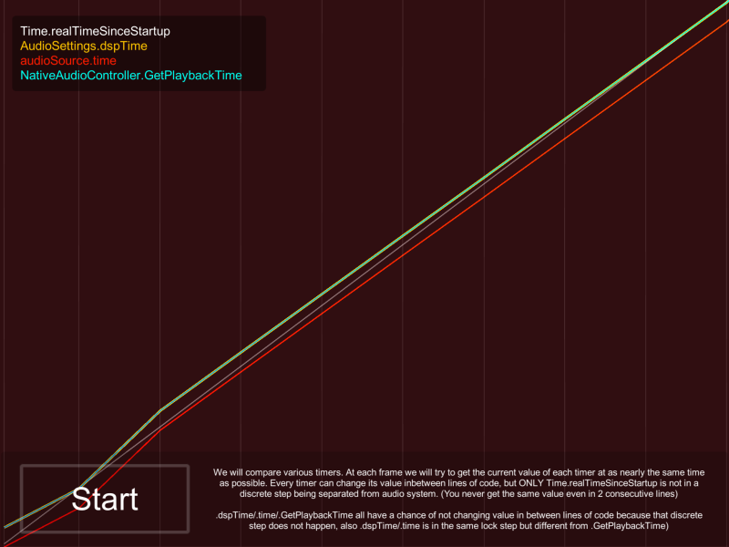

# Bonus : Synchronizing with dspTime

You [just read](index.md) that we shouldn't sync to audio time. For most rhythm game getting the backing track accurate is enough. But what if you do need to? Maybe in games other than rhythm games, maybe if you arrive at a certain place while the song is nearing it's chorus, you switch the chorus to a more epic version, for example.

You want the real current audio time as real time as `Time.realTimeSinceStartup`. That API change its value even in 2 consecutive lines of code indicating that it is very real-time.

From my research `AudioSettings.dspTime` and `audioSource.time` updates in a separated **discrete step**. In the same frame if you ask the value it may or may not change depending if that update step happpen in between the line of code or not. But in 2 consecutive line of code it is very likely that it will stay the same unlike `Time.realTimeSinceStartup`

And now comes to the native time. In version 2.0 you can ask `dspTime` of audio played by Native Audio. Unfortunately I found that both Android and iOS reports a time that is also update in discrete step like `dspTime`. It seems that all audio engine are like this and nothing is truly real-time.

There are differences though :

**\[Android\]** the step is still discrete but independent from Unity's dsp step (`AudioSettings.dspTime` and `audioSource.time`) if those two change in between lines of code, Android time may not change. If Android time change, those two not necessary have to change. You see the blue line does not wiggle in the same way as red and yellow.

**\[iOS\]** The time from OpenAL is surprisingly in the same lock step as `AudioSettings.dspTime` and `audioSource.time`. Indicating that they internally use the same system. If one of them stay still the rest also stay still.

On iOS you see that yellow and blue overlap often. The time from native often stay closer or even the same as current `dspTime` than asking from Unity's audio source. It might be that because there is less latency the audio start sooner and only red line is delayed.

Native Audio purchase comes with the test scene for producing the graph above just for fun.

Also this issue came to light for me because of this tweet one Discord member shared to me. Awesome find!

<blockquote class="twitter-tweet" data-lang="en">
Syncing music in Unity is tricky. timeSamples and dspTime *both* seem to point to the audio buffer start, not the current playback position <a href="https://t.co/Ha6MDxQNuX">pic.twitter.com/Ha6MDxQNuX</a>
&mdash; Freya Holmér (@FreyaHolmer) <a href="https://twitter.com/FreyaHolmer/status/845954862403780609?ref_src=twsrc%5Etfw">March 26, 2017</a></blockquote>

