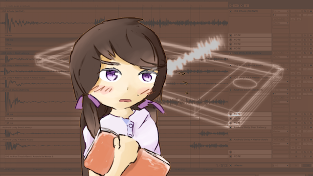

# Rhythm Game Crash Course

Since I guess many of developers interested in using Native Audio is making a music games with Unity, I might as well provide some guides to help you save some dev times.

Some of this are not related to Native Audio, if you land on this page and don't know what even is Native Audio or Unity maybe you can still get something out of this!

Wish you the best on the journey to create this niche but wonderful genre of game.

## It should be fun

Before any of these technical tricks to make the game correct, patterns and game design make the game fun. I advise you take a trip to [Game design and notecharting](game-design-and-notecharting.md) page first, then nail technical aspects with information on this page.

My personal thinking is that I will not release a game that is not fun. Of course that goes without saying, but believe it or not when you actually own the game you are tempted to release it while your inner spirit says otherwise. Not to mention storm of comments from your friend and relatives to "just release a minimum viable product" then improve from that point, or "release is better than never". Find your "minimum" standard and tell them just playable is not enough. If you have more experience with music games, you can hear your inner voice louder that your game is nowhere near as fun as the other game.

## Playing the backing track

Unless you are making a game where you create music from nothing then there must be some sort of backing track in the game. You don't need Native Audio for this backing track because it is **not a response sound**, using just normal Unity `AudioSource` + `AudioClip` is perfectly fine.

You will then have to use various tricks to make it "stick" with any of Unity's time value as possible so you can reference to judge player's action precisely, will comeback to this later.

For example a drumming game where you drum to the compressed BGM. You could get fastest response using Native Audio with the drum sound while not costing much space. Native Audio is for solving latency problem in playing short response sound which **you could not predict** it will play or not. And you want it to play the fastest possible **if it should play**.

The meaning of that is for example, the drumming game will not play the drum sound if you did not hit the screen. Games with coins to collect will not play coin collection sound if the player missed them.

But if there is only backing track in your game (which it play for sure) then the problem is **solvable without Native Audio but with fixed offset/calibration**.

## The backing track latency problem

In rhythm game first you have to get the backing track to line up with the first "note" (what is that depending on your game) and the rest will stay correct UNLESS the game lags or the audio lags. 90% of the time the game lags and audio went ahead of the game since audio is not in the same processing unit with the game anymore after the play command. The lag requires separated resolution and I will not talk about it right now.

Audio in Unity is "fire and forget". When you ask Unity `AudioSource` to play it will take **variable** amount of time and play whenever it feels like. This must be at least after the end of the current frame because Unity has a mechanism to mix and determine sources with high priority to play, meaning that it has to collect play commands first and not that it can play immediately *at that line of code*.

After the end of that frame it is up to the device how fast can it get the data to vibrate the speakers. Each device especially Android has different audio latency.

We cannot easily calculate the latency in-game without proper equipment like a loopback cable or some difficult tricks like auto calibration which the phone records its own speaker.

So the backing track problem on Android is usually solved by having the user calibrate by themselve since Android has different audio latency by device. If there is only backing track and no response sound then I think this is the best way to do it.

After the user get the correct offset for the device, then it is *your job* to make the offset stays true, stays the same every start of the play. Some rhythm game has problem even with manual calibration because each restart of the game the offset is different. This is programmer's mistake and could make the user frustrated that he get the calibration right or not, making him go back to calibration screen again and again even if it was not his fault.

## Starting the music precisely

As mentioned in prevous section after your player have solved the device specific latency for you, it is now your job to make that value right every time. (every restart, score attacker players will "retry" a lot)

1.  Preload the audio accordingly. How "accordingly"? It depends further on your audio import type! More on this in the page [Audio import settings](import-settings.md).
2.  **Immediate playing (literally) is not possible**, the only solution is to use [`audioSource.PlayScheduled`](https://docs.unity3d.com/ScriptReference/AudioSource.PlayScheduled.html) which can specify a precise point of time **in the future**. Your audio will now be intentionally delayed, but more precisely start playing at that time. It is better than asking it to play right now and not really getting the "right now". This method use `dspTime`, and be mindful of **where** you ask the `AudioSettings.dspTime` since this value has possibility to change (or not) even in-between lines of code. The only thing to ensure is this time should be far enough into the future for it to "prepare". If you says "right now" (exactly `AudioSettings.dspTime` or lower, an impossible request) then the method has no benefit over the `audioSource.Play` and it will cry as it has no possible way fulfill your request of "right now".
3.  According to the time in the future that you use here, line up you game's event (the note, the first measure, whatever your game is about) as close to that time as possible. Since Unity is based on frame & game loop, it is also impossible to aim for a frame in the future to land exactly at that scheduled time. So your logic has to have some way to include the "over time" (difference of time between the actual landed frame and the scheduled time you made) in the calculation, and then it would appears like your frame was landed exactly in-time.

## How to execute code the earliest in the frame

With the nature of `dspTime` and `realTimeSinceStartup` that change its value every time even in consecutive line of code, It might be desirable to nab the value at the same point of code in every frame as possible if you are looking to grab a reference time or something. Remember it and use it with codes that comes later in the frame. Native Audio even play audio faster for real if you could execute it earlier, it is not frame-dependent.

In Unity this is a bit troublesome since `Update` runs a bit late even with Script Execution Order moved to topmost. The earliest step is "Initialization" step. But to get your code to this step is currently not easy.

1.  With the new experimental `PlayerLoop` API you can add custom code to that step. See [http://beardphantom.com/ghost-stories/unity-2018-and-playerloop/](http://beardphantom.com/ghost-stories/unity-2018-and-playerloop/)
2.  If you are already adopting DOTS/ECS in your code, placing your system in `InitializationSystemGroup` will ensure your logic will be among the first in the frame. (It will do the `using UnityEngine.Experimental.PlayerLoop;` injection thing for you.)

## The response sound problem

(...finally Native Audio's job!)

With backing track correct, the only problem left is if your game has any kind of response sound like differing perfect/great/bad sound or coin collecting sound. Response sound cannot be calibrated/compensated so the best is to rely on a way to play the sound with shortest possible latency possible. [See 4 classes of audio applications](classes-of-audio-apps.md) and realize why the one with response sound such as music games is the hardest to solve.

This is finally a task for Native Audio. It is not hard... use it. And get the most immediate playing as possible.

Do realize that immediate playing will always still be **less accurate than correct calibration**, but calibration cannot work with response sound since you have to move the sound "earlier" in time to compensate with the latency which make the sound go "later". You cannot move reactive sound "earlier" than the input that makes the sound. Unless you are a psychic or use neural network to predict that the player will surely hit the screen and activates the response sound.

There are interesting cases depending on your game which you can actually predict or get away with. For example if your game has a long note sound which plays on hitting the long note head, then that maybe can come a little late as it plays continuously and not hampering the experience too much. (So you might not need Native Audio) Or what if you have a note which play one sound if you **miss** and another sound if you hit it? In this case you can preemptively play the miss sound even before confirming the input with nicely design hit sound that blends with the miss sound. If the player hit, the miss that plays anyway can serve as part of the a-bit-delayed hit sound. This works because there is a sound that plays without input (missing). I am sure there are other clever design based on your game.

You can get even faster response sound by an other **indirect mean**, that is speeding up the input that cause the response sound in the first place. I made [Native Touch](http://exceed7.com/native-touch/) just for this.

## Some numbers for timing value

Does it really matters if your backing track playing or response sound is late by just 10-20ms? To see the perspective on this, here's some higest-judgement timing windows from various games compiled by an avid music gamer.

<blockquote class="twitter-tweet" data-lang="en">
Dynamix 59ms Deemo 50ms ユビート 41ms? ガルパ 40ms ボルテ 33ms Arcaea 25ms ポップン 25ms
&mdash; スターライト🌌 (@Sta_Light_) <a href="https://twitter.com/Sta_Light_/status/1020704143231500289?ref_src=twsrc%5Etfw">July 21, 2018</a></blockquote>

<blockquote class="twitter-tweet" data-lang="en">
ウニ、太鼓も 33ms VOEZは 30ms 弐寺は 20msで DDR ＞＞＞15ms＜＜＜ Cytusは 70msです
&mdash; スターライト🌌 (@Sta_Light_) <a href="https://twitter.com/Sta_Light_/status/1020879071222292480?ref_src=twsrc%5Etfw">July 22, 2018</a></blockquote>

Notice that these numbers are not random but is around a multiple of frame rate time (60FPS is 16.666ms, 120FPS is 8.3333ms for example) so they can be based on in-frame time checking not the true "hardware input time".

One of the weakness of Unity's current input system is there is no touch timestamp, the new input system Unity is making along with my [Native Touch](http://exceed7.com/native-touch/) is able to get hardware touch time.

Anyways, look at DDR for example the timing for Marvelous judgement is just 1 frame of 60 FPS. (Not sure if the cabinet run at 120 FPS? So you can "see" the arrow moving 2 steps inside this window of time) and there are players that can MFC (Marvelous Full Combo) a ridiculous song like this.

> [!Video https://www.youtube.com/embed/r2Z-qi9IPF8]

So it means 16.67ms is a window of time that human can surely focus on unmistakenly for 2 minutes straight. This small number is actually pretty significant. That's why I go as far as using both Native Audio and Native Touch to sqeeze the lowest latency not caring about Unity's team hardwork of bringing convenience for me.

## The audio rarely lags

An important point that might not be obvious. All the things in your game is updated together with game loop probably based on `deltaTime` on each frame. Depending on how you use the `deltaTime`, the audio is always going forward and is not lagging together with your game! If the game lags, it is possible that your game is now "behind" the audio. In this case, a "resynchronization" is needed. (Or the player will just press retry anyways...)

## The audio do lags... the buffer underrun

Depending on what you choose Best Latency / Good Latency / Best Performance, Unity will get you an audio buffer size of 256, 512, and 1024 respectively. (I thought it would be depending on phones, but as far as I tried it is not the case. Could never be sure in the future though)

You want as small as possible to get minimum latency, however too small that CPU could not pump out bits of audio to the memory that the speaker is playing in time, the speaker don't know what to do and produce what people is calling lagging, glitching, scary, squealing,slowdown, bugged, squeaking, zombie, stuttering, garbled (honestly I had received so many different symtoms and the adjective was never the same). What's important is that your game will now be ahead of audio. And this is not easily detected programmatically, the best should be ensuring the buffer size is the lowest but large enough in the first place.

Sadly some phones could not handle the size 256 or even 512. For example I heard that Huawei P20/P20 Pro/Mate 20/Mate 20 Pro/Mate 20X could not (even they are top-of-the-line phones!). And then your non-Native Audio audio like BGM that you left it to Unity internal to play is now garbled and unusable. What now? The best solution I could think is to include a slider in your option menu for the player to adjust if they found audio problem. The slider could then leads to [`AudioSettings.Reset`](https://docs.unity3d.com/ScriptReference/AudioSettings.Reset.html). I have a report that the earlier mentioned devices works on size 1024. Surprisingly, Native Audio is using a number much lower than 1024 for those devices (something like 240) and it works without buffer underrun. The only conclusion is that Unity's audio processing put too much work on those phones that any lower size couldn't handle anymore. This "bug" was found as early as version 5.5.5, and it is [still active](https://issuetracker.unity3d.com/issues/android-sound-stuttering-issue-on-huawei-mate-20-pro) to this day! My god!

For some reason on Windows build, choosing Best Latency **always** result in unusable buffer size. Unity, why??

## The starting calibration problem

Including the calibration in your option screen is a must if you care about Android at all. However imagine a new player that doesn't even know how to play your game or where your option screen is. They jumped in and play the tutorial, fails hard because of the latency, then quit your game. You definitely don't want this.

Many games display a popup right after the tutorial that says please go to option screen if what you played just now didn't feel right, because putting this notification before the tutorial would otherwise interrupt the "onboarding ceremony" and confuse some non-technical users like my mom.

What's better is to pre-set a certain calibration number so that even new player can enjoy the tutorial and potentially some easy songs, until he realize that wrong calibration is holding him back. By that time, your player will already be invested in the game and be less likely to quit.

The simplest is to use some "magic number" which you are quite sure no Android device could perform better. But what's better is to somehow "estimate" a per-device latency and start the game with that. The question is how?? Some middleware like Criware's adx2 do have an estimation function that performs black magic and get you a convincing estimation, without special calibration tools like a loopback cable and it didn't require the mic input. (It's closed source!) I want my Native Audio to be able to do that too, but for now... just deal with it.

What is your "0 ms" ? You can make your starting calibration says "0 ms" on the UI but underneath there are a fixed value padded to it. This could make the player feel like "0 ms is already accurate". If your 0 ms is literally 0 ms, it is more likely that it will always be wrong. Even considering the phone is perfect, if your player didn't use an earphone then there is the time that sound travel through air. Still a good idea that your 0 ms already account for this little time. Maybe 0 ms equals 5-10ms earlier, for example.

You may have an idea of consulting a "database of latency" so each device can start at the correct number. There is one on [Superpowered website](https://superpowered.com/latency), but I have yet found a good enough way to map device at runtime to that database. Good luck!

## The judgement problem

The player hit the screen according to music, but how is your code judge that hit? It is 100% true that when you get a chance to run your judgement logic (a frame comes) it is **already later than that audio moment**. If you use the time at the beginning of this frame, it is still later than the actual time since the player must have touched the screen the last frame in order to be detected this frame. If you judge using this time, player that hit early will have an advantage since the time will be moved a bit later, players that hit late will be punished and might get a judgement downgraded.

The correct solution is the **touch timestamp**. All native Android and iOS provides the time stamp but Unity have discarded them all, making the most correct time the frame time. If you are interested in improving judgement accuracy you could try [Native Touch](http://exceed7.com/native-touch) where you can get the touch timestamp. (It is difficult to use however, I must admit.)

## The "finger nail" players

I believe players nowadays learned to turn off the tap sounds when their phone has bad latency, so make sure an option to turn off the response sound is there for them.

But! Experienced players even intentionally turn off the tap sound regardless of phone's latency (even if they have an iOS, the original and the most awesome low latency device). Because their finger nail sound is going to be the most accurate feedback sound possible, traveling straight to their ear. These players will calibrate the game so that if finger nail traveling through air matches the audio coming through hardware latency then through air/headphone matches, they should get a perfect. So it is also very important to include a calibration option alongside with tap sound on/off, so players could do this.

This is the thing why DDR has such a cruel judgement but player still manages to hit it. It is because player could match the **shoe's step sound** to the music and truly feel the beat (your body even vibrates at the same time in this game, the extra feedback with no hardware required). The game is one of a few remaining games that do not allow calibrating the judgement in any way inside the game. It is not because they are sure the cabinet has no latency (impossible) but because, the cabinet has been calibrated precisely so that if your shoe's step sound that travel through air matches with music you hear from the cabinet, from the standing distance of the pad and speaker, you will get the Marvelous judgement (16ms, 1 frame of 60 FPS). Thinking like this, in the DDR game code they must play the audio early so that it delays through hardware and the air to the perfect moment that the sound from your shoes arrive at your ear without hardware latency, at the same time as the arrow matching the receptor. (Speed of sound through air [do vary](https://www.nde-ed.org/EducationResources/HighSchool/Sound/tempandspeed.php) according to temperature too! But don't go around asking the operator to decrease air conditioner just because you couldn't get a perfect.)

## Do not sync game state with audio time / dspTime

This might be your idea : Play the music. Then continuously asking the current time of the song right now on every frame from hardware. Then based on that time, it determines everything on the screen (combined with speed mods, etc.) By this approach, the game will always stay on sync with an audio.

This is not a good idea. First, that audio time is `dspTime`. `dspTime` is **not real time**, it updates in a certain steps. You have **no way** to know where the audio is right now. It might sounds ridiculous, but imagine audio is a "fire and forget" thing like you launch a rocket. When you would like to know the location of the rocket, you kinda could measure that but by the time you finished measuring it already moved so fast on its own that the measurement is not useful anymore. In technical explanation, audio are running on its own thread and the measurement couldn't block it. What you hear came from a chain of pipelines that keeps pouring audio bytes to the speaker. This "pipeline" is not as simple as "playhead is here, you are hearing this" but rather some bits of audio are already on queue to play (that is not the current position you are asking). So by asking audio time, that is not the correct representation of what you hear. On iOS you might be able to get away with this, but on Android you will notice that the time returned is not smooth enough (from Unity's API or Native Audio's native time API, it's the same.) Even if the game "technically" stick to the audio all the time, this stick is not smooth, causing even more irritating experience than smooth gameplay that is continuously drifting from the audio due to lags.

Instead, base your game on your own `float` that you keep increasing each frame. Together with this `float`, play the audio in a way that it is always reliable to ask your own `float`, and interpret it as audio time. This way, you must HOPE that it is still going together with the audio after some time had passed. But before hoping that, get the beginning right using things like scheduling play to start an audio in the **precise future**, then "anchor" this future time with your `float` accordingly that this `float` is the audio's "zero second". Remember that immediate play will never be immediate, delayed future is always better.

If your game is running perfectly the `float` should be reliable. If the game lags, as explained earlier, the "fire and forgotten" audio may not lag along with the game and cause your `float` to be behind, then you may have to resync by make the audio jump to your `float`, or jump your `float` to the audio. (but this will cause the game to jump, as you are basing your game's state on the `float`.) If the audio lags by buffer underrun or something, unfortunately this case is very difficult to fix. You just hope the player restart the song and try again.

## Any other tips?

-   2019.1 has an improvement on normal Unity audio latency on Android. Wider range of devices now receive faster audio source. [Read about it here.](https://gametorrahod.com/unitys-android-audio-latency-improvement-in-2019-1-0-ebcffc31a947) Useful if you have a part of your game as Native Audio but longer sounds/sounds that need a mixer or effects as Unity's.
-   On iOS with Native Audio, don't forget to set to Best Latency in Project Settings / Audio. On Android it does not matter since this settings influence Unity-allocated audio source and we allocate a new one with our own setup. But in iOS, this settings will modify the device's buffer size that is used in common for both Unity audio and Native Audio. Native Audio do not try to influence what Unity's had setup currently, so for example choosing Best Performance will also slow down Native Audio on iOS. (You still gain time difference from skipping Unity mixer and also instant in-frame play advantage not having to wait until the end of frame.)
-   If you have plugged in your device, your touch will be randomly slower due to electric static. Since input time influence the perception of audio latency, it might trick you that the audio sometimes come out slower. (This is the reason [Native Touch](http://exceed7.com/native-touch/) could indirectly trim down a little bit more latency.)
-   Check your audio file if it contains any silence at the beginning in the file or not. A program like Audacity has a command to instantly trim both ends of silence.
-   An audio with sharp and sudden attack will feel more responsive. An audio with slow fade-in will feel like there is a latency where it actually is a part of audio. If you compose your own SFX, you can improve perceived latency by sound design.
-   If your audio is a part of input's response, using Native Audio directly on the callback of touch from OS ensure the fastest possible play. But only if the callback is fast, and you have some mean to make the OS call something in Unity on touch. (My [Native Touch](http://exceed7.com/native-touch/) was born to do that) Annoyingly on some platform like Android IL2CPP, native to C# callback is slow. But not a problem on Android Mono, thanks to JIT compilation and also not on iOS IL2CPP since it could be compiled statically.
-   Continued from the previous point, it is still possible to get even faster and super clutch audio playing by modifying the native side touch handling entry point to call native side of Native Audio, not having to go to Unity at all! This way it is like you are writing a native game! However the hack would be very messy and how would you check Unity things at purely native side in order to check some conditions on that touch? (Unless your game is about touching the screen and play a sound no matter where it is..) Just to point out that that way nothing could be faster. (And also none of my plugins support that hideous optimization, but you could hack it out if you want...)