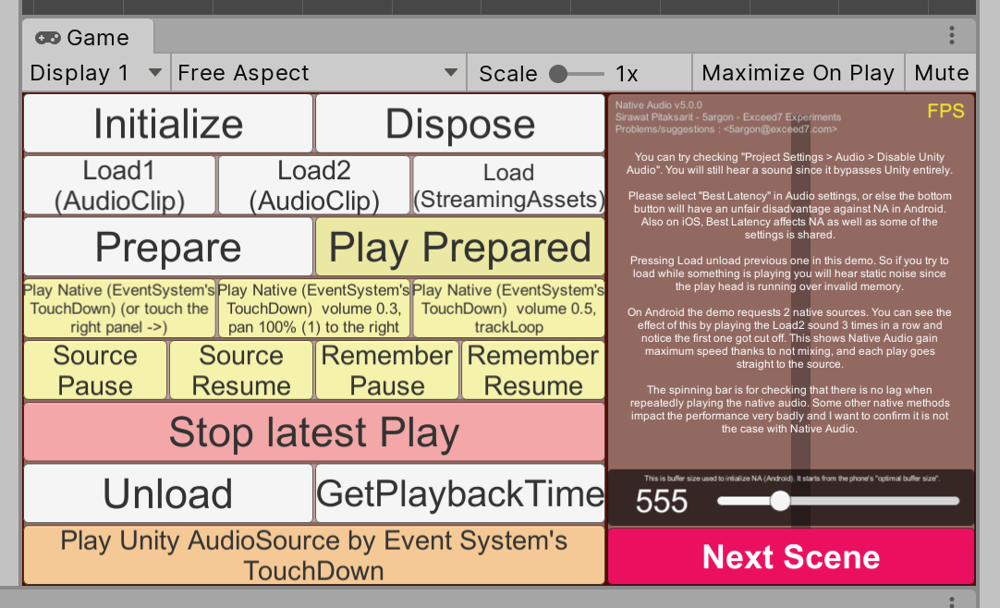
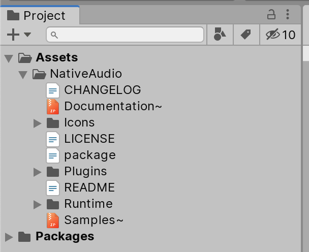
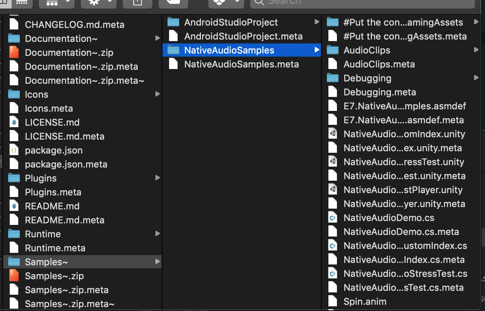
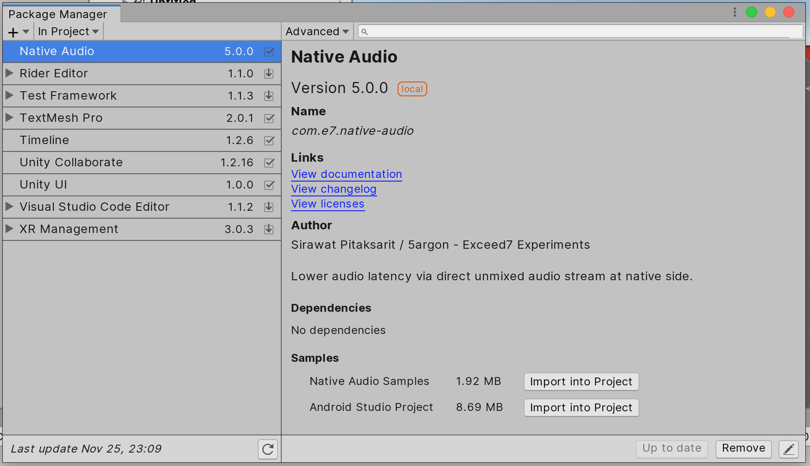
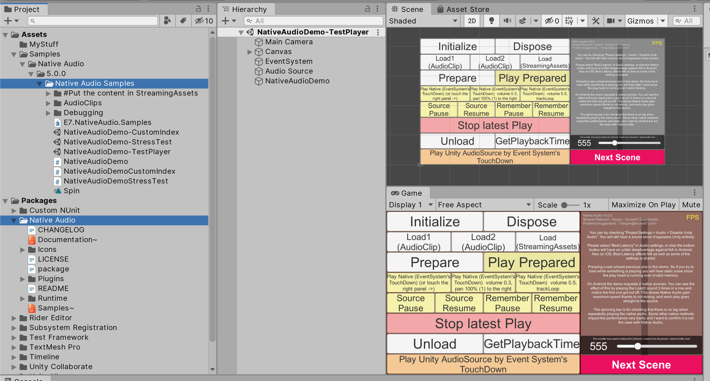

# Samples

You can either see the sample scenes or download a built .APK to try on your Android device even before purchase. There are various buttons that corresponds to each method call. Lastly a button to play an audio using normal Unity `AudioSource` so you can feel the difference.

iOS do not have any easy enough way to distribute samples yet so only Android is available. Sorry for inconvenience.

(I tried using TestFlight public testing before which supports 1000 testers, but the submission process was too much. They even denied because the icon happen to "looks like an iPhone". lol)

## Prebuilt player

- [Android (13.73 MB)](https://exceed7.com/dl/native-audio-android)

## Sample scene

You can see the scene in Unity editor and build it to test on your devices. This is useful for iOS where there is no prebuilt samples available.

After importing Native Audio you can see `Samples~.zip`. Unzip it to get an unimported `Samples~` folder [because of trailing `~`](https://docs.unity3d.com/Manual/SpecialFolders.html). This is great as you only want to import the samples only when you want to see it and not by default on package install.

To get the sample to import, go inside with your OS's file explorer and copy the desired sample folder out to your own project. You can safely delete the whole folder after you are done with it.

### Unity Package Manager (UPM) samples importing support

If you use UPM linking to the package instead of normal importing so Native Audio appears on the Project panel in `Packages` section instead of `Assets` section, you can see an import sample button in Package Manager.

Press it and the content inside `Samples~` will be copied out to your project effortlessly. You can also clearly see what to delete after you are finished with the sample. Sweet!

