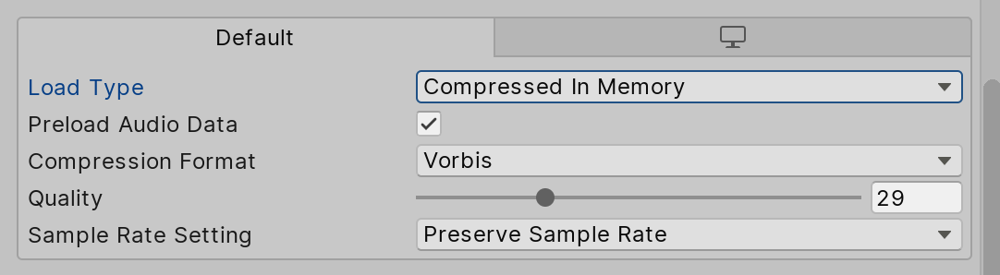

# The audio import settings

And their meaning to music games.

## Format

You will notice PCM, Vorbis, and ADPCM format. Just use Vorbis because with PCM for music that's crazy large..

## Quality

Quality 100 is too good. With Vorbis you can select quality and I think most casual players would not notice the difference between 40-100. About quality you can actually go very low. Cytus 1 I believe has around 15-35 for all songs. (Just a guess! Remember that if they have lossless `wav` source but you have 192kbps source then your 15-35 will be not as good) It might sounds bad and like an insult to composers who made the song at first when you audition it. But! ...if you do that for all the songs player won't notice that the song is bad. Haha!

VOEZ/Dynamix is better since the song will be downloaded from the internet/delete-redownload at will and they don't have to care about app size. (You can do this if you have the funding to run a server for everyone, might be risky if you could not turn around for profit fast enough to beat server cost) Deemo is also really bad, I guess it is around 10-25. If you compare the song "Like Asian Spirit" of Deemo and VOEZ you will immediately notice the quality difference between off-site downloaded audio and have-to-save-space app bundled audio. Deemo one has much "darker" high end like being filtered by a soft low-pass filter.

Also depending on genre, if it is very electronic you can go low unnoticed but acoustic song usually have to be around 25-50 to sound good because clear high-ends that has little of anything else like acoustic guitar will sounds obviously bad on low quality. I suggest decreasing the number and listen until it sounds bad for each songs **individually**. As you lower the quality, pay attention to higher end of the spectrum as that will be the first one to degrade audibly. It will get more "fuzzy" like you listen to radio and you tune the channel out of range gradually. I found that the important degradation step usually occur in between these ranges : \[100-40\] \[39-25\] \[24-20\] \[19-10\] \[9-0\]. At high value it is hard to notice the difference.

## Load Type

Compressed in memory, decompress on load, or streaming? I am assuming you know the fundamental difference of each. Streaming might be tempting because you use very very small amount of memory for the entire play which save your RAM and also your load time is magically almost none. But there are problems.

`audioClip.LoadAudioData` can do a blocking call to ensure completely loaded audio you can use in now loading screen before the play, and so this is the correct "preparation" to ensure your plan to precise-start goes well. **But it does not work only with Streaming loading type.** It works with any PCM, and Vorbis as long as you choose Decompress on Load or Compressed in memory.

So your game will not wait for the load and start immediately because internally, Streaming audio does not have a concept of "loading" it think the load is done right away. (I think actually it loads only just a small bit not the entire audio) And your player might complain that on each restart the offset is not the same. Usually the first play is bad and the later restart is better. But if the phone lags at the moment you are restarting you will get a bad offset again since Streaming cannot wait the load by any means. I am quite sure that `audioClip.loadState` is immediately Loaded after LoadAudioData with Streaming but actually it did not. So you cannot wait for the load.

But big advantage of Streaming type for music game is for the music select screen. You could scroll through all music and play the preview music very fast. With other load type player would have to wait for the song to load completely to hear the preview music. Or alternatively you have to include **a separated audio for preview music** (now can set as Streaming for fastest preview and degrade the quality more, while the real one in gameplay set as Compressed in memory with higher quality) but it would increase your game size by the preview size. (Average preview might be around 10 seconds, if 1 min of compressed audio is roughly 1 MB then you pay about 16 MB for 100 songs)

In the game Dynamix and Tone Sphere I noticed that the preview music is lower quality than what you hear in the gameplay. Possible that they are using this separated preview and actual audio technique. For SFX you can use PCM for the fastest load time but larger file size or Vorbis + Decompress on load for slightly longer load time, smaller size, and results in raw PCM after decompressing anyways. Sound effect is not large so you might go for PCM but for long sound effect like fanfares, long wind ambient sound, etc. you might use Vorbis + Compress in memory.

But what if you really want Streaming so you get both fast preview music in music select screen with maximum quality like what's in the game AND also don't have to include 2 music for every song? How I deal with the variable offset at the start when we cannot rely on `audioClip.LoadAudioData` is to play the audio at volume 0 as a warm up for about 1-2 second then start the real playback. It is the only way to make sure streaming audio loads, by actually playing it. When you play it again for real it is possible to **hope for** the same audio data that it still keep in the buffer. (But still not 100% reliable)

## The Sampling Para... Rate

You can choose to preserve or resample right in the Unity audio importer. I think this is not important as Unity will resample everything to 24000Hz before mixing to one bus anyways [as I found out on Android](https://gametorrahod.com/androids-native-audio-primer-for-unity-developers-65acf66dd124#c340). (Not sure about other platforms?) But I think you can decrease the imported size by lower the rate. (Not sure if it will chipmunk your sound or not since now you have less data, but will the play head consume audio slower according to this new lesser data?)