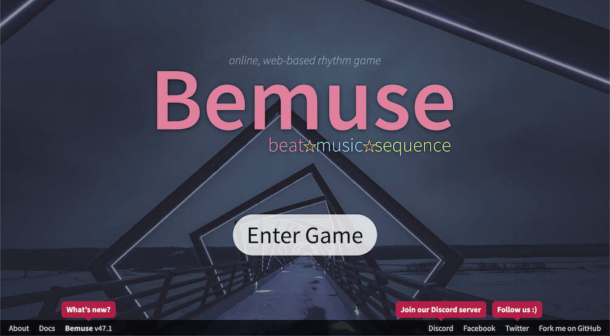

# Tips from Bemuse's creator

[@dtinth](https://github.com/dtinth), the creator of [Bemuse, the web-based online rhythm action game](http://bemuse.ninja/) based on HTML5 technologies, React, Redux and Pixi.js, shares some of his techniques related to latency. Thank you!

- On the web we don't have access to native stuff, so when I develop Bemuse, I have no control over the latency. Had to do a lot of workaround. (BTW, browsers keep improving this all the time. For example, Chrome on my Android phone used to have 120ms+ latency. Now it's around 70ms.)
- Problem of huge latency: On devices with high latency, we can convert reaction sound to layer sound (a la Guitar Hero). Bemuse, when latency is higher than 10ms, switches to another mode. It will auto-play the keysounds before the player hits the keyboard, but if the player missed the note, that previously played sound is canceled and auto-play is temporarily disabled until the player hits another note, which will turn auto-play mode back on. That note will sound late though (a tradeoff). Also, if the player hit the note with OFFBEAT judgment, the pitch is shifted slightly as a punishment.
- Problem of synchronizing to audio time: On the web, `AudioContext.currentTime` may (only in some browsers/OS) update in discrete steps (when buffer is flushed, as opposed to "real" time) as well. Bemuse works around that by continuously collecting samples of (dspTime - gameTime) **delta offsets**. It averages the delta over the last second period, and use that offset to determine real audio time from game time. This means buffer overruns and audio jumps will not cause sudden jump in-game. The notes will scroll faster/slower to catch up with dspTime.
- Problem of input in-between frames: Instead of treating the tap action as an event that happened in a single point in time, we can consider a range of time in between two frames instead. The trade-off is judgment will be more lenient if the framerate drops, but in my opinion **a framerate drop is a punishment in itself already**.
- Another kind of visual aid is to have a color code for different types of rhythm class (4th/downbeat, 8th/upbeat, 12th/triplets, etc.). This allows people to play very gimmicky chart like this one from UK Sightreading Tournament

> [!Video https://www.youtube.com/embed/F69zEKYVLHE]