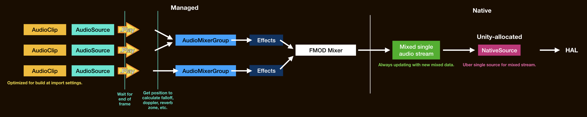

# Sources of latency

It will get hardcore from this point, but if you are already here then you are already willing to do anything for lower latency. Let's get started.

It's not magic nor so simply that "Unity sucks". It is important to understand exactly where latency came from, to understand what Native Audio is doing and what compromises you get. Many of these are not engine specific, it may applies to Unreal devs as well so feel free to read them.

### Unity latency : From `AudioSource.Play()` to hearing it

([View in full](images/before.jpg))

#### Latency : Native source initialization settings

At the start of your game, Unity requests *an instance* of **native source**. This is a platform-specific abstract concept that sit right before [HAL](https://en.wikipedia.org/wiki/HAL_(software)), which is going to tell the speaker to vibrate and let us hear something. Depending on platforms, there maybe a limited number of this. They all then jointly control the HAL to play audio.

**Various settings on initializing the native source affects latency**. Are they spawned on a performance thread or a power-saving thread? Are they wired to a certain limited number of faster paths that the OS designed? Are they given a suitable audio to their initialized settings?

Unity was choosing a very defensive settings that increases latency, that was designed to be well compatible with everything you could modify in `AudioClip`'s [import settings](https://docs.unity3d.com/Manual/class-AudioClip.html). Although for Android [it got better in 2019.1](https://gametorrahod.com/unitys-android-audio-latency-improvement-in-2019-1-0/), we can still do better with Native Audio.

#### Latency : Mixing

I mentioned **an instance**. Usually all it wants is **1 audio data stream**, so it could tell the hardware to vibrate exactly according to it. At any moment what you hear is just 1 audio stream, but in Unity side you may have imported many `AudioClip` of separated, smaller streams. At one exact moment you maybe still hearing the tail of bomb sounds played earlier, together with a confirm UI sound you just asked to play the last frame. 

The thing you may not have thought before is, audio buffer sounding *exactly like that* must exist somewhere in memory so the native source could run through and tells HAL to vibrate. There is no such thing as "give" a bomb sound *then a bit later* "give" a UI sound to the native source and let the magic happen. It just run through data and vibrates speakers.

You see you don't have such a specific stream. But you do have a separate `AudioClip` streams of *just* a bomb and *just* a confirm UI sound. **The answer is audio mixing**.

Unity need to actively mix audio at application level producing just 1 stream all the time, to feed to this 1 native source requested at start. Of course Unity need to mix and place mixed data ahead of the playhead a bit.

If Unity can't and the playhead catches up at the end, you have [buffer underrun](https://en.wikipedia.org/wiki/Buffer_underrun) and audio will glitch out because it has nothing more to play but is still expecting more.

It depends on buffer size too, which a larger size gives Unity easier time to make a new one in time while the native source is still playing the old one. However big buffer means larger latency, imagine you have to wait for the first big chunk to be filled to hear it, before we could go to make a next one while that one is playing. ("double buffering" technique) We want the smallest buffer that is not causing buffer underrun for our lowest latency purpose. Also a device may have its own preferred buffer size as well.

Back to the example, Unity must add a latter part of bomb sound with a just requested first part of UI sound and place the summation to a buffer memory area that native source is going to run through. This will be on threads so the next frame may continue while Unity is doing so, but anyways **mixing takes time** and we don't know at what frame since we did `AudioSource.Play()` that we will finally hear it.

Unity uses FMOD audio library to perform these things.

#### Latency : Audio engine functions

At least mathematically mixing is just adding up numbers. But Unity also has audio channels that you could route to with `AudioMixerGroup`. It then pass through a chain of effects and a volume fader on each channel. This adds more calculations.

Maybe it also perform something like limiting so that overly hot audio won't sound exploded. Limiting require a look-ahead time and that means you have to intentionally wait to see the future, so you can prevent the danger that is incoming.

#### Latency : [`AudioSource`](https://docs.unity3d.com/ScriptReference/AudioSource.html)

You may have used `AudioSource.Play()` which sounds like it is a single `AudioClip` player of sorts (but multiple `AudioSource` could then create an ensemble of `AudioClip`), or `AudioSource.PlayOneShot()` which could magically mix over it old self for some reason. They look simple and barebone, but many functions in `AudioSource` cause, or rather, need latency.

- `GameObject` dependent : Spatial features on [`AudioSourceCurveType`](https://docs.unity3d.com/ScriptReference/AudioSourceCurveType.html) require the current position of `GameObject`. Something like [`dopplerLevel`](https://docs.unity3d.com/ScriptReference/AudioSource-dopplerLevel.html) may need movement speed. Having to process these `GameObject` (`Transform`) across many objects together to deduce what the audio should sound like could be costly. When we want the best latency, it is likely that we want to ignore these completely or fake by a more indirect mean. e.g. A drumming app that need low latency may want to play an audio like they came from the left when you hit the left snare, but rather than using spatial feature you can bake a stereo snare hit that already sounds like coming from the left. It is not like the drummer can move to somewhere else and change this "left".
- The need to wait for the end of frame : It maybe natural for you if you play 2 different audio in a different `MonoBehaviour` but in the same frame, and you expect the two to come out at the same time. This is because `AudioSource` system **collects** all the plays in this frame together at the end to finally decide what it should do. This ties with some feature like [`priority`](https://docs.unity3d.com/ScriptReference/AudioSource-priority.html), we can't decide which one take priority over which without waiting to see all sources first. Or the number of voice limit that is default to 32 in the settings. The logic that keep track and decide who to cut out needs to be somewhere and that adds latency.
- `AudioSource` itself is a component : The reason why Unity DOTS was invented is to get rid of scattered and unorderly data that is detrimental when you want to iterate through a lot of them. A lot of `AudioSource` is of course costly, the same goes for a lot of other components.

However Unity is a fully fledged game engine. Extensive functions like these are expected. It would be very counterintuitive if you play a new `AudioClip` the next frame then everything else before goes silent. It is not wrong that Unity came with these designs, but it is unfortunate that we cannot stop using them when the need arises. Native Audio fill this role and let you use only the essentials.

### Hardware and OS latency

Something out of reach of Unity, but it is something that set iOS apart from Android as a premium device for audio application. 

This Native Audio can't help, but you could study about them from website like [Superpowered](https://superpowered.com/androidaudiopathlatency). The tests in this kind of website already tried to do the most native and the fastest way possible (programmed using Android Studio, etc.) and yet there are still more to desire, as opposed to iOS's fantastic latency. Native Audio helps achieve that level of performance except you can use Unity instead of Android Studio.

### Perceived latency

There are other unexpected sources of latency that maybe added even more :

- Maybe an input latency is significant. If the audio is a response of player's input, input latency of the touch screen is added to the perceived latency and make it even more unsatisfying. This Native Audio cannot help, but I did make something like [Native Touch](https://exceed7.com/native-touch) to push the boundary.
- Maybe having a clear reference trick you to think there is more latency. For example if touching a button instantly flash the screen and play a loud sound, the audio latency is going to be much noticable than changing the animation to a more gentle white fade out.
- Maybe the audio sounds soft (has sloped attack [envelope](https://en.wikipedia.org/wiki/Envelope_(music))) that it sounds like it is not that instant. You may change your sound design to help with this.
- Maybe you mistakenly left some silence at the beginning and adds fake latency.
- Maybe the temperature of the air or quality of your headphone influence how fast the audio travels to your ear.
- Maybe you just wake up and everything sounds slower than it should be.
- Maybe your ears are just less sensitive than others.

### Native Audio : Making compromises and obtaining the best latency

Continue in the [Ways around latency](ways-around-latency.md) page how Native Audio get around each point with what compromises.