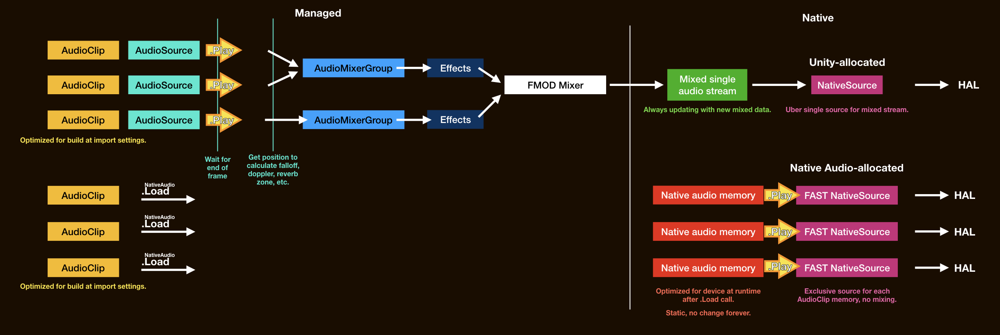

# Ways around latency

See how Native Audio solve each point presented in [Sources of latency](sources-of-latency.md) page.

([View in full](images/after.jpg))

## Additionally request and intialize our own native sources

We let Unity have that one uber-native source for application-mixed audio. However on `NativeAudio.Intialize()` we can initialize **more** of our own, but with the best setup for latency.

The way to do this is with help from a native library of respective platform that sits above a "real" native method, that would otherwise be too difficult to mess with. In iOS, Native Audio uses [OpenAL](https://www.openal.org/). In Android, Native Audio uses [OpenSL ES](https://www.khronos.org/opensles/). Both are capable of requesting additional instance of native sources without touching OS code. They are an officially-supported higher level wrapper.

You may have been spoiled from the front page, or hinted from [Sources of latency](sources-of-latency.md) page that Unity mixes audio and with Native Audio we won't. **Each `AudioClip` exclusively go to 1 native source and the next `AudioClip` played on the same native source cuts off the previous one completely.**

A popular third party audio engine like [Criware ADX2](https://www.criware.com/en/products/adx2.html) also has a direct mode specifically for Android that works the same way. (Can't mix, direct to a numbered native source of your choice on each play.) I want to say that it is not like Native Audio is doing something THAT outrageous here.

## Problems on number of native sources

Then it is a good idea to have **multiple sources** for "native mixing" if I should call it. By multiple native sources playing at the same time, it will sounds like we did mix the audio data and send the result to only one source like Unity did! ...only that the number is quite limited. Now you may think why don't we request infinity native sources? Because there are limits.

#### iOS

On iOS, Native Audio's implementation results in as much as 15 native sources to choose from for each play. There are plenty of room for playing strategy that it ended up sounding like mixed audio.

#### Android (!!)

More worrisome on Android, there are tons of details and limitations! If you got **an hour**, you can dive into details in my [Android Native Audio Primer for Unity Developers](https://gametorrahod.com/android-native-audio-primer-for-unity-developers/).

But in short, all applications on a device **shares** common number of limited native sources. Let's say a certain mid-end phone has 15. However only 7 of them are a special **fast** source. You can imagine the phone already took one for its system sounds, Unity may or may not (more likely to take smarter choice [after 2019.1](https://gametorrahod.com/unitys-android-audio-latency-improvement-in-2019-1-0/)) take an another on game's start (good, at least it helps the Unity audio out a bit more), and maybe some minimized app that didn't program to release the native source is hogging some more. 

We want to request as much native sources as possible, in a way that it doesn't trouble other things on the phone, in a way that doesn't crash the game, and in a way that we **only get fast sources**. Getting a mix of fast and slow sources is frustrating as in play you may randomly get faster or slower latency. (Again, with good strategy you may keep using the fast one until in a pinch.)

**Native Audio decided that the default is 3 on Android.** Now that's very limited! Though, with some creativity and planning I believe you can get away with this amount. An example strategy : You may *always* designate your UI sounds to only use native source #0. It's fine that new UI sound cut off the previous one as they are short anyways. (Unless it is an epic level-up sound, then you may not consider it a UI sound.) Then all other sounds keep alternating between native source #1 and #2 back and forth. 

But of course you can push this amount up **at your own risk** with an argument overload `NativeAudio.Initialize(initializationOption)`, which I highly recommend completing my [Android Native Audio Primer for Unity Developers](https://gametorrahod.com/android-native-audio-primer-for-unity-developers/) first to understand what is this "risk" I am talking about. In my opinion, 5 is borderline safe for all-fast (in a situation that Unity and phone both took 1 each, 5+1+1 = 7), but too risky as a default thinking about how crippled cheaper Android phones could be, so I choose 3. More than that? Good luck.

## Initialize native sources with the best specs for latency

Congratulations on choosing the right number of native sources. And good luck on getting as much fast sources as possible. No matter fast or normal sources you ended up getting, now it's Native Audio's job to prop them up for the best for latency.

A device has its own **native sampling rate**. Newer phones prefer 48000Hz, while older ones may prefer 44100Hz. Each native source need a settings how frequent (how fast) should it read audio data it was asked to play. And the phone would really love it if the native source is **initialized at the same native rate as the phone**. I don't understand much deeper than this, but maybe it is useful to think that the speaker (a tangible, non-abstract thing that these abstract native sources have to use) would like to vibrate at a certain rate.

You think it is a no-brainer, so just ask the player's phone what is the native sampling rate and initialize that. Happy ending. But wait, it affects the audio that you will use too. Imagine having an `AudioClip` sampled at 44100Hz in your project (or other rate, but used Unity's [resampling-at-import](https://docs.unity3d.com/Manual/class-AudioClip.html) option forcing it to be 44100Hz). If the native source was configured to read at 48000Hz because the phone loves that, the audio would be chipmunked because it will burn through the data much faster than designed (than recorded).

Dilemma : 

- If we respect the phone's rate for the best latency : do we have to make 2 versions of all `AudioClip` to 44100Hz and 48000Hz (and who knows if a phone with 96000Hz rate would be released next?) wasting more than doubled space just so it is ready to be played for both rate?
- If we hard-fixed all imported audio clip in the game to 48000Hz via import settings, then hard-instantiate 48000Hz native source to prefer newer phones no matter what the phone prefers : then older 44100Hz phones suffer non-optimal performance while could hear the correct sounding audio. Though it is likely that as years passed the device with 44100Hz native rate would eventually dies out (?), it is not an elegant solution.

Unity's answer to this problem? I don't have a license to native source code so I can't confirm 100%, but by `adb` log dump debugging reveals that sometimes Unity mysteriously instantiates 24000Hz rate ([why this number?](https://gametorrahod.com/android-native-audio-primer-for-unity-developers#unity-s-24-000hz-sampling-rate)) and all Android audio sounds glitchy like they turned into 24000Hz too. This is very likely a defensive strategy for compatibility. But not for either quality or latency. On iOS I found that it sounds more like what I set at import. This mystery of the black box is only on Android's side.

Native Audio's answer? We shoot for the best latency so of course we respect the rate that the device wants. Now what to do with the chipmunked audio dilemma? Native Audio fix it by spending more time at each `NativeAudio.Load(audioClip)` to resample audio data on the fly (at runtime) to the device's rate. It has to be "on the fly" since this rate is unknown until the game is run on the player's device. You cannot predict what phone your player will use to play your game at `AudioClip`'s import settings in Unity.

**Increased load time doesn't matter** if it means a faster play after it had been loaded and resampled to be optimally fit for your player's phone. Pay the loading and resampling cost once, you may play this optimized audio memory as many times as you like.

Native Audio utilized [Secret Rabbit Code](http://www.mega-nerd.com/SRC/) C++ library for in-memory audio resampling on the fly. You are required to include an attribution to its 2-clause BSD license which is very permissive for such a good technology like this.

## Exclusive memory area for native play

Each `NativeAudio.Load(audioClip)` **copies** data from `AudioClip` to be completely independent from Unity, resampled and optimized as explained. This new memory is kept at native side so native source could use it without worry about what is happening at C# side anymore.

([View in full](images/after.jpg))

Also it is very suitable for our "unmixed" policy. It is just a matter of telling a native source which memory we want it to play. (The beginning address of it, and its length.) As you see, **the `Play` call is now much closer to the HAL**, just a direct memory to native source, one-to-one, no mixing.

We can still keep the Unity way around for audio that doesn't require critical latency, but require higher concurrency. Let them take time to mix and applying effects as much as they want. We can selectively play critical audio in Native Audio's express lane.

Wasted 2x+ space on both uncompressed [`AudioClip.GetData`](https://docs.unity3d.com/ScriptReference/AudioClip.GetData.html) and also the copied native audio memory? Of course. But it is not a problem as we must make sacrifice for latency. After copy you can let the GC collect the one at C# side.) Anyways most audio suitable for Native Audio should be "small but critical".

`NativeAudio.Load(audioClip)` returns `NativeAudioPointer` of loaded memory area at native side to C# side. What's left is only to get an `AudioSource` equivalent called `NativeSource` (that's what you get at initialize), then you can `nativeSource.Play(pointer)` from C#. We are done!

## No longer have to wait until the end of frame

By "we are done", I mean the native source literally go ahead and run through the specified memory on the pointer **right at the line of code that you call `NativeSource.Play`**.

You requested to play a UI sound, maybe as a reaction to touch input, which already take precious time until you finally arrive at the frame that you know a touch happened. In this frame, ideally you want to hear it **now**. "Now" as in right at that `AudioSource.Play()` line of code. So "now" that 2 consecutive `AudioSource.Play()` calls theoretically cannot ever sound at the same moment. But Unity doesn't work that way as explained in the [Sources of latency](sources-of-latency.md) page. Native play works this way if you use `NativeSource.Play` instead of `AudioSource.Play`.

With this you saved potentially 0~16.66ms, which is a frame time for games at 60 FPS, or more. Do I need to mention that DDR's Marvelous judgement is also 16ms? This is unexpectedly significant gain other than the mix skipping we already got.

An optimization strategy maybe possible now, you can try to call `NativeSource.Play` at the earliest ordered `MonoBehaviour` in the frame as you can.

## All fluffs skipped

We have eliminated all functions of Unity's mixer like `AudioMixingGroup`, Unity's component like `AudioSource` and all its spatial goodness, even the audio data we actually play is no longer tied to `AudioClip` because we copied. All the methods are `static`. We have removed all the weights. It maybe sad though that `NativeSource.Play` got less variety of options than you used to, but who cares as long as that was traded for better latency.